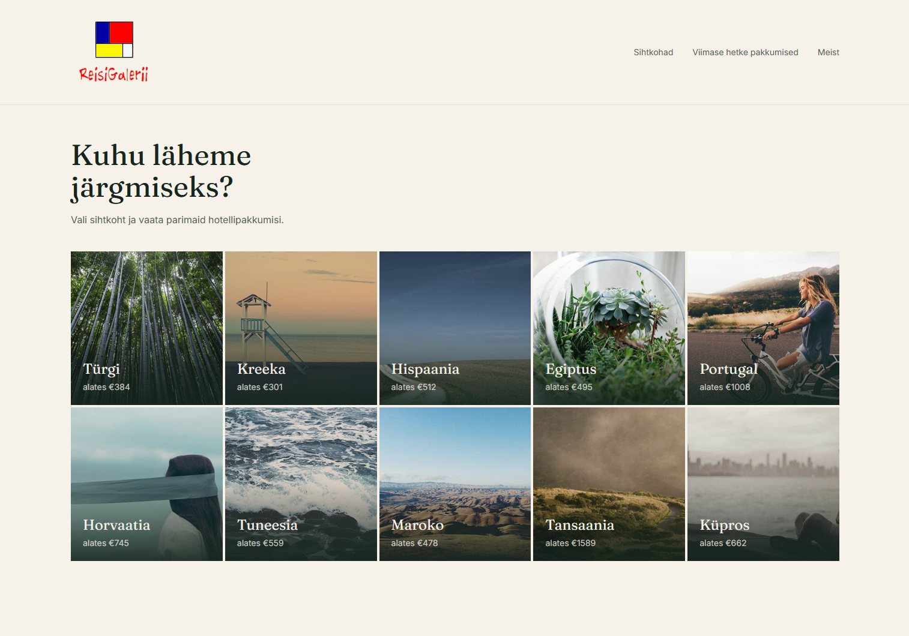

# Reisigalerii

A travel agency for the Estonian market — pick a country, browse hotel offers, and get connected with a real travel agent to finalize your booking directly.

**Live demo:** COMING SOON 🚧



## About

Reisigalerii is a small travel agency who are long due for a website.Instead of handling bookings and payments directly, the site connects interested users with a real agent to close the deal — keeping the experience simple while a person handles the actual sale.

This repository contains the **frontend only**. It currently runs on demo data while the backend integration with partner travel APIs is in progress.

## Features

- Visual country picker as the entry point, instead of a flat filterable list
- Country-specific hotel results with filtering by duration, price, and star rating
- Client-side routing with shareable URLs (e.g. `/sihtkoht/kreeka`)
- Responsive layout, built mobile-first

## Tech stack

- React
- Vite
- React Router
- Tailwind CSS
- lucide-react (icons)

## Running locally

```bash
git clone https://github.com/vincentrandla/reisigalerii-frontend.git
cd reisigalerii-frontend
npm install
npm run dev
```

The app will be available at `http://localhost:5173`.

## Status

🚧 In progress — currently using placeholder data. Live integration with partner travel agency APIs and a working backend (Java/Spring Boot) are the next milestones.

## Why I built this

I wanted a portfolio project that reflected a real problem rather than a tutorial clone. Building the API integration layer to normalize inconsistent data from different providers has been the most interesting technical challenge so far.
